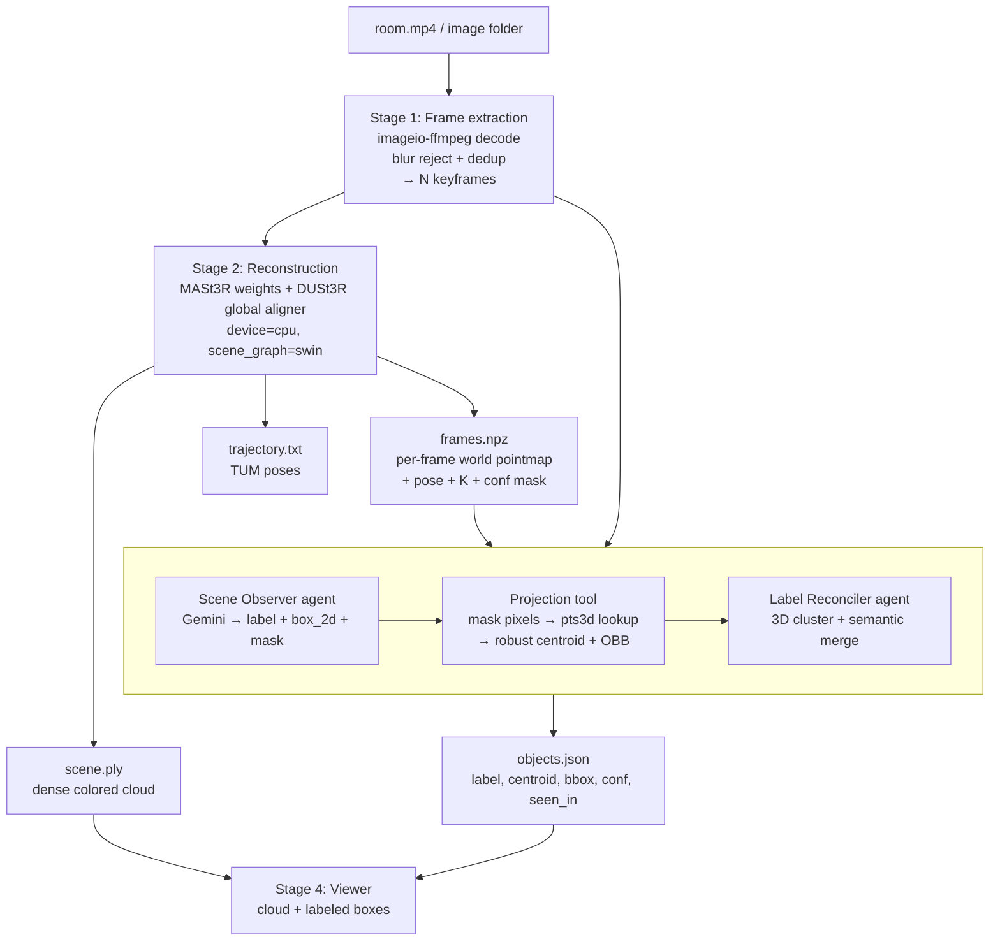

# 3D Room Mapping + Agentic Labeling POC — Implementation Plan

> **Part 1 (below) is built and verified** — 144 tests, pipeline runs end to end.
> **Part 2 — the viewer web app — is the active plan.** Jump to
> [Part 2: Viewer Web App](#part-2--viewer-web-app).

## Context

**Goal:** turn a casual phone-camera walkthrough of a room into (1) a dense 3D point cloud,
(2) the camera trajectory, and (3) a labeled scene — objects with approximate 3D positions,
produced by an agentic pipeline rather than manual annotation. Offline batch is fine.

**What changed from the original brief.** The brief specified MASt3R-SLAM as the reconstruction
core. Environment research says that is not runnable here:

| Check | Result |
|---|---|
| GPU | Intel Arc iGPU only — **no NVIDIA, no CUDA, `nvcc` absent** |
| CPU / RAM / disk | Core Ultra 7 155H (16C/22T) / 31.4 GB / 487 GB free |
| Python | 3.12, 3.13, 3.14 present (no 3.11 yet) |
| `uv`, `ffmpeg`, `colmap`, `docker` | all absent (WSL present) |
| API keys in env | none — Gemini key to be added to `.env` |

MASt3R-SLAM compiles custom CUDA kernels during `pip install --no-build-isolation -e .` (the
IPM matching kernels are the entire source of its real-time speed) and pins CUDA PyTorch. There
is no CPU path. It is a hard blocker on this machine.

**The resolution.** We drop the *SLAM* layer, not the *model*. We keep MASt3R's network and run
it through DUSt3R's global alignment optimizer on CPU. Two facts make this work:

1. `naver/mast3r` ships `demo_dust3r_ga.py` — "the same demo as in dust3r (+ compatibility for
   MASt3R models)" — so MASt3R weights drive the DUSt3R global aligner directly.
2. The only CUDA dependency in that path is the optional `curope` RoPE kernel, and croco's
   `pos_embed.py` has a pure-PyTorch `except ImportError` fallback. Everything else is stock
   PyTorch CPU ops.

**On "can we drop pose estimation?"** — you can't, and you don't want to. DUSt3R's global
alignment *is* the pose solver: recovering a globally consistent point cloud and recovering the
cameras are the same optimization. `scene.get_im_poses()` and `scene.get_focals()` fall out of
the run that produces `scene.get_pts3d()`. Dropping SLAM costs us live tracking and loop
closure, which this POC does not need. It costs us nothing in deliverables.

**The payoff for the labeling half.** Global alignment returns, per input image, a **per-pixel
3D point already in world frame** (`scene.get_pts3d()`), plus pose, focal, and a confidence
mask. That means the 2D→3D projection step — the part the brief correctly flagged as trickiest —
is a **direct array lookup**, not a raycast into a cloud. Pixel `(u,v)` in frame `i` maps to
`pts3d[i][v, u]`. This is the single most important structural decision in the plan, and it
holds identically for MASt3R-SLAM keyframes (`X_canon` + `T_WC`) if a GPU ever appears.

---

## Confirmed decisions

| Decision | Choice |
|---|---|
| Reconstruction | MASt3R metric weights + DUSt3R global aligner, **CPU, local** |
| VLM | **Gemini** (free API key, `.env`) — native bbox *and* segmentation mask output |
| Orchestration | **CrewAI**, with all geometry in deterministic tools |
| Packaging | **uv** |

---

## Architecture

### Data flow



### Repo structure

```
3d_mapping_labeling_poc/
├── pyproject.toml              # uv-managed, requires-python ">=3.11,<3.12"
├── .python-version             # 3.11
├── .env                        # GEMINI_API_KEY  (gitignored)
├── .gitignore                  # checkpoints/, data/, out/, .env
├── configs/
│   └── default.yaml            # frame count, resolution, thresholds, model names
├── third_party/                # git submodules
│   ├── dust3r/                 # naver/dust3r  (contains croco/)
│   └── mast3r/                 # naver/mast3r
├── checkpoints/                # gitignored, ~2.5 GB
├── data/rooms/<room_name>/     # input video or images
├── out/<room_name>/            # scene.ply, trajectory.txt, frames.npz, objects.json
├── src/room3d/
│   ├── vendor.py               # sys.path shim for third_party/*
│   ├── frames.py               # Stage 1
│   ├── reconstruct.py          # Stage 2
│   ├── artifacts.py            # save/load .ply, TUM traj, frames.npz
│   ├── projection.py           # ★ mask/box → 3D  (pure, deterministic, unit-tested)
│   ├── fusion.py               # ★ 3D clustering + merge  (pure, deterministic)
│   ├── vlm.py                  # Gemini client, structured JSON, retries
│   ├── crew/
│   │   ├── agents.py           # Scene Observer, Projection Engineer, Label Reconciler
│   │   ├── tools.py            # CrewAI Tool wrappers over projection.py / fusion.py / vlm.py
│   │   └── pipeline.py         # Crew assembly + run
│   ├── viewer.py               # Stage 4
│   └── cli.py                  # room3d extract | reconstruct | label | view | run
└── tests/
    ├── test_projection.py      # synthetic camera, known geometry
    ├── test_fusion.py          # synthetic duplicate detections
    └── fixtures/
```

**Why submodules and not `uv add`:** neither `dust3r` nor `mast3r` ships a `pyproject.toml` or
`setup.py`, so they cannot be installed as packages. They are vendored as git submodules and put
on `sys.path` by `src/room3d/vendor.py`. This requires `git init` first — the directory is not
currently a repo.

**Dependency handling:** we do *not* use `third_party/dust3r/requirements.txt` directly — it
pulls `gradio`, `tensorboard`, and `pyglet<2` for its demo UI, none of which we need. Our
`pyproject.toml` declares the real runtime set: `torch`, `torchvision`, `roma`, `einops`,
`opencv-python`, `scipy`, `trimesh`, `huggingface-hub[torch]`, `numpy`, `pillow`,
`imageio-ffmpeg`, `pyyaml`, `google-genai`, `crewai`, `python-dotenv`, `open3d`.

`imageio-ffmpeg` is chosen deliberately — it bundles an ffmpeg binary as a wheel, so no system
ffmpeg install is required.

---

## Stage detail

### Stage 1 — Frame extraction (`frames.py`)

Decode video, then select N frames by:
1. Uniform temporal stride as the base sample.
2. **Blur rejection** — variance of the Laplacian; drop frames below threshold, substituting the
   sharpest neighbour within the stride window. Handheld phone walkthroughs are full of motion
   blur and this is the cheapest large quality win available.
3. **Near-duplicate rejection** — drop frames whose downsampled-grayscale correlation with the
   previously kept frame exceeds a threshold (handles standing still).

Output: `out/<room>/frames/000.png…`, plus a manifest with source timestamps.

N is the dominant cost knob. Default 24; configurable.

### Stage 2 — Reconstruction (`reconstruct.py`)

```python
pairs = make_pairs(images, scene_graph="swin-3", prefilter=None, symmetrize=True)
output = inference(pairs, model, device="cpu", batch_size=1)
scene = global_aligner(output, device="cpu", mode=GlobalAlignerMode.PointCloudOptimizer)
scene.compute_global_alignment(init="mst", niter=300, schedule="cosine", lr=0.01)
```

**`scene_graph="swin-3"` is load-bearing.** The default `complete` graph is O(N²) pairs — 24
frames = 552 symmetric forward passes, which on CPU is hours. A sliding window of 3 makes it
O(N) — roughly 130 passes. A video walkthrough is temporally ordered, so a sliding window is also
the *correct* graph, not merely the cheap one.

Extract and persist:
- `scene.get_pts3d()` + `scene.imgs` + `scene.get_masks()` → **`scene.ply`** (confidence-filtered, colored)
- `scene.get_im_poses()` → **`trajectory.txt`** (TUM: `t x y z qx qy qz qw`, matching MASt3R-SLAM's format)
- per-frame `pts3d[i]`, `mask[i]`, `pose[i]`, `focal[i]` → **`frames.npz`** ← *the labeling pipeline's real input*

**Model choice.** `MASt3R_ViTLarge_BaseDecoder_512_catmlpdpt_metric` — the `_metric` head predicts
in real-world units, so the output cloud is metric rather than scale-ambiguous, which makes
"approximate 3D position" mean something. Caveat: the DUSt3R `PointCloudOptimizer` optimizes
per-pair scale factors, so global metric scale can drift. We verify against a tape measurement
(see test plan) and expose a `--scale-ref` override that rescales the scene by a known real
dimension. Fallback if the metric head misbehaves: `DUSt3R_ViTLarge_BaseDecoder_512_dpt`,
accepting scale ambiguity.

### Stage 3 — Agentic labeling (CrewAI)

Four roles. **Geometry lives in deterministic tools, never in agent reasoning** — an LLM must not
be asked to do arithmetic on point clouds.

| Agent | Job | Tools |
|---|---|---|
| **Frame Curator** | Pick the subset of frames worth spending VLM calls on; ensure spatial coverage using poses | `select_frames` |
| **Scene Observer** | Per frame: call Gemini, get objects with `label`, `box_2d`, `mask`, `confidence` | `detect_objects` (Gemini) |
| **Projection Engineer** | Lift each 2D detection to a 3D centroid + oriented box; discard low-support detections | `project_detection` (pure) |
| **Label Reconciler** | Cluster observations across frames into unique objects; resolve label disagreements; emit final JSON | `cluster_observations` (pure) + LLM judgement on synonymy |

**Gemini call.** Use `google-genai` directly inside the tool (not CrewAI's multimodal agent path,
which is fiddly for structured output) with a response schema:

```json
{"objects": [{"label": "monitor", "box_2d": [ymin, xmin, ymax, xmax], "mask": "<base64 png>", "confidence": 0.0}]}
```

`box_2d` is normalized 0–1000 in `[ymin, xmin, ymax, xmax]` order — must be descaled to pixel
coords against the *reconstruction* image size (512-family, not the original 4K frame). This
rescaling is a classic silent-bug site; it gets a unit test.

**Request segmentation masks, not just boxes.** Gemini returns a per-object mask as a base64 PNG
probability map inside the box. A box around a chair contains a great deal of wall and floor; a
mask does not. Since our 3D centroid is a statistic over the pixels we select, mask-vs-box is
directly the difference between a centroid on the chair and a centroid floating between the chair
and the wall behind it. Box is the fallback if masks prove unreliable.

Model: `gemini-2.5-flash` (or current flash). Free tier is ~10–15 RPM / 250K TPM / 500–1500 RPD
depending on model — ample for ~24 frames, but the tool needs rate-limit backoff.

### Stage 4 — Viewer (`viewer.py`)

Open3D window: point cloud + camera frustums along the trajectory + labeled oriented boxes with
text. This is the POC's demo surface and the fastest way to eyeball whether labels landed in the
right place.

---

## The trickiest step, and how we handle it

The brief guessed 2D→3D projection. Half right — the discovery above **demotes projection** from
hard to easy, and that promotes **cross-frame label fusion** to the real hard problem.

### 3a. Projection — now easy, but three real traps

`pts3d[i]` is `(H, W, 3)` in world frame, so a detection's pixel set indexes straight into it.
The traps:

1. **Depth bleed at object boundaries.** Mask edges straddle the depth discontinuity between
   object and background, so a naive mean centroid is dragged toward the far wall.
   → Erode the mask a few pixels, then take a **robust** centroid: cluster the selected 3D points
   by depth (1-D DBSCAN along the camera ray), keep the dominant front cluster, discard the rest.
   Use the median, not the mean.
2. **Low-confidence geometry.** DUSt3R confidence is poor on textureless walls and glass.
   → Intersect every mask with `scene.get_masks()[i]` before computing anything. If fewer than a
   threshold fraction of pixels survive, drop the detection rather than emit a bad 3D position.
3. **Resolution mismatch.** Gemini sees one image size, `pts3d` is another. Off-by-one/transposed
   indexing here produces plausible-looking but wrong coordinates — the worst failure mode.
   → Single `descale_box`/`mask_to_pixels` helper, unit-tested against a synthetic scene.

Output per detection: `centroid` (median 3D), `obb` (oriented bbox from the retained points),
`n_points`, `geom_confidence`.

### 3b. Fusion — the actual hard part

One chair seen in 6 frames must become one object, not six. Two different chairs must not become
one. The failure modes point in opposite directions, so a single distance threshold cannot win.

**Approach: 3D-first greedy clustering with LLM adjudication only on semantics.**

1. **Bucket by geometry.** Greedy agglomerative clustering over detection centroids, with a merge
   radius scaled to object size (`max(0.3 m, 0.5 × mean OBB diagonal)`), not a flat constant — a
   sofa and a mug cannot share a threshold. Require OBB IoU above a floor as a second gate.
2. **Gate by semantics.** Two detections merge only if geometry *and* label agree. Label agreement
   is where the LLM earns its place: `"monitor"` / `"computer screen"` / `"display"` are the same
   object; `"chair"` / `"desk"` are not, even when adjacent. The Label Reconciler agent is handed
   the candidate cluster's label multiset and returns a canonical label plus a merge/split verdict.
   Deterministic geometry proposes; the LLM only adjudicates naming.
3. **Vote for confidence.** Final confidence combines observation count, mean VLM confidence, and
   geometric tightness (centroid spread across observations). An object seen once at low
   confidence with scattered geometry ranks below one seen five times with a tight cluster.
4. **Keep provenance.** Every object records `seen_in: [frame ids]` so any bad label is traceable
   to the frame that produced it. Essential for debugging, and cheap.

Both `projection.py` and `fusion.py` are pure functions over arrays with no LLM in the loop, so
both are unit-testable against synthetic scenes with known answers. That is deliberate: it is the
only way to tell a geometry bug apart from a VLM bug when the output looks wrong.

### Final output shape

```json
{
  "room": "office_01",
  "units": "meters",
  "scale_verified": true,
  "objects": [
    {
      "id": "obj_003",
      "label": "monitor",
      "aliases": ["computer screen", "display"],
      "centroid": [1.24, 0.88, -2.03],
      "obb": {"center": [...], "extent": [0.6, 0.35, 0.05], "R": [[...]]},
      "confidence": 0.86,
      "n_observations": 5,
      "seen_in": [3, 4, 5, 11, 12]
    }
  ]
}
```

---

## Test plan — what counts as "working"

Gates, in order. Each must pass before the next is worth attempting.

| # | Gate | Pass criterion |
|---|---|---|
| 0 | **CPU feasibility spike** *(do this first, before writing pipeline code)* | 6 frames at 512 through MASt3R+GA on CPU produces a coherent cloud. Record wall-clock per pair. **If a pair exceeds ~30 s, stop and re-plan** — that is the whole schedule. |
| 1 | Frame extraction | 24 sharp, non-duplicate frames from a real walkthrough |
| 2 | Reconstruction | `scene.ply` is recognizably the room: walls planar, floor flat, no folded geometry. Trajectory is a smooth path, no teleports |
| 3 | **Metric scale** | Measure one real object with a tape; the reconstructed extent is within **±15%**. If not, apply `--scale-ref` and record that scale is calibrated rather than native |
| 4 | Projection (unit) | Synthetic scene, known camera, known object → projected centroid within 1 cm of ground truth |
| 5 | Fusion (unit) | 5 synthetic detections of one object + 1 of a nearby different object → exactly 2 clusters |
| 6 | **End-to-end labeling** | Hand-list M visible objects in the room beforehand. **≥70% (N of M) correctly labeled with centroid inside the true object's real extent.** Under 3 false objects |
| 7 | Viewer | Boxes render on the cloud in visually correct places |

Gate 6 is the headline POC claim, and it must be measured against a list written *before* looking
at the output. Gate 3 matters more than it looks: without it, "approximate 3D position" has no
units and the JSON is not usable downstream.

---

## Scope

### v1 — first working version

- Single room, single video, offline batch
- CPU reconstruction via MASt3R + DUSt3R global alignment
- Fixed frame budget (~24), sliding-window pair graph
- Gemini detection with masks, one pass per frame
- Deterministic projection + geometric clustering with LLM label adjudication
- `objects.json` + `scene.ply` + `trajectory.txt`
- Open3D viewer
- Unit tests for projection and fusion; one end-to-end room

### Nice-to-haves — explicitly not v1

- Natural-language query over the map ("where are the chairs?")
- Room layout: floor/wall plane extraction, per-object room-region assignment
- Multi-room / multi-video merging
- Active re-inspection: agent asks for a better frame when an object is uncertain
- Instance counting ("4 chairs" as 4 objects with individual poses)
- MASt3R-SLAM path behind the same artifact interface, for when a GPU is available
- Gaussian splat / mesh export
- Web viewer instead of desktop Open3D

---

## Assumptions — please correct any that are wrong

**Input**
1. One room, 30–90 s handheld walkthrough, slow steady pan, 1080p+ MP4, H.264.
2. The room is reasonably textured and well lit. Large blank white walls, mirrors, and glass are
   known weak spots for DUSt3R-family models and will produce holes.
3. Loop closure is not required — a walkthrough that roughly returns to its start is fine, but we
   do not correct drift over a long loop.
4. Room is normal-sized (an office/bedroom, not a warehouse).

**Compute**
5. Reconstruction runs on this laptop, CPU-only, **estimated 20–60 min per room at 24 frames**.
   This is an estimate, not a measurement — Gate 0 exists to replace it with a real number before
   any schedule depends on it. Peak RAM estimated 2–4 GB, well inside 31 GB.
6. `uv` will be installed (`irm https://astral.sh/uv/install.ps1 | iex`), and Python 3.11 pinned
   via `uv python install 3.11` — 3.11 is what dust3r/mast3r target; 3.14 is too new for this stack.
7. ~2.5 GB of checkpoint download, plus torch CPU wheels.

**Labeling**
8. Gemini free tier is sufficient (~24 image calls per room, well inside 500–1500 RPD).
9. 10–20 nameable objects per room; we target common furniture/office vocabulary.

---

## Licensing — where this blocks production

Flagged per your request. **The entire reconstruction core is non-commercial.**

| Component | License | Commercial? |
|---|---|---|
| MASt3R code + checkpoints | CC BY-NC-SA 4.0 | ❌ |
| DUSt3R code + checkpoints | CC BY-NC-SA 4.0 | ❌ |
| MASt3R-SLAM | inherits the above | ❌ |
| CrewAI, Open3D, PyTorch, OpenCV | Apache/MIT/BSD | ✅ |
| Gemini API | commercial terms available on paid tier | ✅ (see below) |

The checkpoint restriction is worse than the code restriction: MASt3R's `CHECKPOINTS_NOTICE`
requires agreeing to the licenses of every training dataset used, and the **mapfree** dataset
terms in particular are highly restrictive. Retraining on clean data is not a weekend job.

**Production paths, if this POC succeeds:**

1. **VGGT-1B-Commercial** (facebookresearch/vggt) — feed-forward, one pass over N images, outputs
   extrinsics, intrinsics, depth maps, and point maps; **a commercially-licensed checkpoint exists**
   (military use excluded; access via application). Reported accuracy is equal or slightly better
   than the non-commercial checkpoint. Critically, its output shape is the same per-frame pointmap
   + pose structure, so **the entire labeling half of this pipeline ports unchanged.** This is the
   strongest option and is the reason to keep `frames.npz` as a documented interface rather than an
   internal detail.
2. **COLMAP / GLOMAP** — BSD, unrestricted, CPU-capable. No learned priors, so it needs more
   frames and more overlap and fails on textureless surfaces, but it is legally clean today.
3. Negotiate a commercial license with NAVER.

**Also non-obvious:** Gemini's **free tier permits Google to use submitted content to improve their
products.** Fine for a test room; not fine for a customer site or anything confidential. Moving to
the paid tier changes this. Worth knowing before the first client demo.

---

## Build order

0. **Gate 0 spike first.** `git init`, install `uv`, pin 3.11, add submodules, download the MASt3R
   metric checkpoint, run 6 frames through MASt3R + global alignment on CPU. Time it. Everything
   below is contingent on this number.
1. `frames.py` + `artifacts.py` + CLI skeleton
2. `reconstruct.py` → `scene.ply`, `trajectory.txt`, `frames.npz` (Gates 1–3)
3. `projection.py` + `fusion.py` with unit tests against synthetic scenes (Gates 4–5) — **built and
   tested before any VLM is wired in**, so that end-to-end failures are attributable
4. `vlm.py` — Gemini detection with masks, schema validation, backoff
5. `crew/` — wrap 2–4 as CrewAI tools, assemble the four agents (Gate 6)
6. `viewer.py` (Gate 7)

Step 3 preceding step 4 is intentional. If geometry and VLM are wired up together, a wrong-looking
box gives no information about which half is broken.

---
---

# Part 2 — Viewer Web App

## Context

The pipeline works but its output is three files and a desktop Open3D window. There is no way to
pick a video, watch a run, or interrogate the result — and interrogating it is exactly what the
first real run showed to be necessary.

**What the `living` run revealed.** 27 objects where the room has maybe 10: four separate
`pillow`, four `shelf`, two `cabinet`, three `houseplant`, and `armchair` / `office chair` /
`chair` / `bean bag` all clustered within ~30 cm of each other. Twenty of the 27 have
`n_observations: 1`.

The cause is in the trajectory, not the fusion code: **the eight camera centres span only ~0.6 m.**
The clip is a pan, not a walk. Without translation there is little parallax, depth is poorly
constrained, and fusion cannot match an object between views because its two 3D positions disagree
by more than any sane merge radius.

That is the single most useful thing the app must communicate, and it is invisible in
`objects.json`. So this is not decoration — it is the diagnostic instrument for the POC.

**Decisions taken** (confirmed): top-down floor-plan map rather than a panorama (a stitch assumes
rotation about a point; a walkthrough translates, so seams warp); live re-fusion controls; clean
and functional visual style.

## What has to change in the pipeline first

`objects.json` carries no 2D boxes — `LabelingSession.detections` and `.observations` are
discarded when the run ends ([pipeline.py:97](src/room3d/crew/pipeline.py#L97)). Highlighting an
object on a photo, and re-fusing without paying for the VLM again, both need that data on disk.
Four small edits, all in existing files:

| File | Change |
|---|---|
| [projection.py](src/room3d/projection.py) | Add `box_px` to `Observation`; `project_detection` accepts and stores it |
| [crew/tools.py](src/room3d/crew/tools.py) | `ProjectDetectionsTool` passes the descaled `box_px` through |
| [fusion.py](src/room3d/fusion.py) | `ObjectRecord` gains `observation_ids`; `_finalise` records cluster membership |
| [crew/pipeline.py](src/room3d/crew/pipeline.py) | Write `observations.json` beside `objects.json` |

`observations.json` becomes the second documented artifact interface:

```json
{"observations": [
  {"id": 0, "object_id": "obj_001", "frame_idx": 2, "label": "sofa",
   "box_px": [x0, y0, x1, y1], "centroid": [...], "n_points": 812,
   "vlm_confidence": 0.93, "support": 0.71}
]}
```

Re-fusion then reuses `cluster_observations` **exactly as it stands** — it is already pure, with
`label_compatible` and `canonicalize` injectable ([fusion.py](src/room3d/fusion.py)). Re-clustering
27 objects takes milliseconds and costs no API calls.

## Architecture

FastAPI backend serving a single-page vanilla-JS frontend with three.js. No npm, no build step —
this is a local tool and a bundler would be the largest thing in the repo.

```
src/room3d/webapp/
├── server.py       FastAPI app, routes, SSE run progress
├── rooms.py        discover/load artifacts from out/*  (reuses artifacts.load_frames_npz)
├── floorplan.py    top-down render + world<->pixel transform
├── refuse.py       re-cluster from observations.json  (reuses fusion.cluster_observations)
├── runs.py         subprocess job runner + stage parsing
└── static/{index.html, app.js, style.css, vendor/}
```

New CLI verb in [cli.py](src/room3d/cli.py): `room3d ui [--port 8000] [--open]`.

### Endpoints

| Route | Purpose |
|---|---|
| `GET /api/rooms` | list `out/*` with which artifacts each has |
| `GET /api/rooms/{r}` | summary: frames, points, objects, extent, **camera span** |
| `GET /api/rooms/{r}/cloud?max_points=` | decimated cloud as raw binary |
| `GET /api/rooms/{r}/frames/{i}` | keyframe PNG |
| `GET /api/rooms/{r}/objects` \| `/observations` \| `/trajectory` | JSON |
| `GET /api/rooms/{r}/floorplan?up=` | top-down PNG + world→pixel transform |
| `POST /api/rooms/{r}/refuse` | re-cluster with new params; `?save=true` writes `objects.json` |
| `POST /api/runs` | start a pipeline run |
| `GET /api/runs/{id}/events` | SSE progress stream |

**Point cloud transport.** 939k points. Do not ship the 13 MB PLY and parse it in JS. Serve
`Float32Array` xyz + `Uint8Array` rgb as one binary response with a JSON header, seed-decimated
server-side with numpy. Default 300k points, slider to full. This is the difference between an
instant load and a visible stall.

**Runs.** Reconstruction is 12–40 min, so a request cannot hold it. `runs.py` spawns
`room3d run ...` as a subprocess and parses the stage markers the pipeline already prints —
`[extract]`, `[reconstruct]`, `[detect]`, `[cluster]`, `[label]` — into progress events over SSE.
No new logging format needed; the markers exist because the CLI already emits them.

**Floor plan.** Project points onto the floor plane and rasterise a 2D histogram coloured by mean
RGB. The up-axis is auto-estimated by RANSAC on the lowest points, with a manual override in the
UI — DUSt3R has no gravity vector, so guessing silently would be wrong. The response includes the
world→pixel affine so the client can draw object footprints and map clicks back to world
coordinates.

## Frontend

A persistent **object sidebar** beside a tab strip. Selecting an object highlights it in whichever
view is open — that is the interaction the request is built around.

**Sidebar:** object list (label, confidence, n_observations, frame count); text filter; sliders for
min confidence and min observations; the re-fusion panel (merge radius floor, radius scale, OBB
IoU) with **Re-fuse** and **Save**. Re-fuse is instant, so the sliders are explorable.

**Tabs:**

1. **Run** — pick from `video_examples/*` or upload, set room name / `--n-frames` / direct-vs-crew,
   start; live log with per-stage progress and elapsed time.
2. **Frames** — keyframe grid; click to enlarge; overlay detection boxes from `observations.json`;
   selected object's boxes highlighted, others dimmed.
3. **Point cloud** — three.js orbit view; object OBBs as wireframes; selected object highlighted
   and camera framed on it; point-size and decimation controls; camera-frustum toggle.
4. **Floor plan** — top-down map with object footprints; click a footprint to select.
5. **Trajectory** — camera path, per-frame positions, inter-frame distances, and **total camera
   span called out explicitly**. This tab exists because it is what would have shown the 0.6 m
   parallax problem in five seconds.

Dark theme, system font stack, no animation beyond hover/selection states.

## Verification

**Unit tests** (extend the existing 144):
- `observations.json` round-trips; `box_px` survives projection.
- Re-fusing `living`'s cached observations with default params reproduces the current 27 objects
  exactly — proves re-fusion is the same code path, not a reimplementation.
- Raising `merge_radius_floor` monotonically decreases object count.
- Floor-plan transform: world → pixel → world round-trips within a pixel.
- Cloud decimation preserves the bounding box and returns exactly `max_points`.
- `GET /api/rooms` on a directory with a partial room (no `objects.json`) degrades rather than 500s.

**Endpoint tests** with FastAPI's `TestClient` against the real `out/living` artifacts.

**Browser verification with Playwright MCP** — load each tab, select an object, confirm the
highlight appears in the frame overlay and the 3D view, screenshot each tab. This is available in
this session, so "it renders" gets checked rather than asserted.

**Manual acceptance:** `uv run room3d ui --open`, load `living`, and confirm the Trajectory tab
makes the 0.6 m camera span obvious, and that raising the merge radius collapses the four pillows
into one.

## Scope

**v1:** everything above.

**Not in v1:** panorama stitching (deliberately dropped); renaming or hand-editing objects;
exporting annotated media; multi-room comparison; auth or any non-localhost deployment. The server
binds `127.0.0.1` and is not hardened for exposure.

## Assumptions

1. Local single-user tool on `127.0.0.1`; no auth, no concurrent-run locking beyond one job at a time.
2. `fastapi`, `uvicorn`, `sse-starlette`, `python-multipart` added to `pyproject.toml` — the first
   three are already resolved transitively via CrewAI, so this mostly makes them explicit.
3. three.js and OrbitControls vendored into `static/vendor/` by a one-time
   `scripts/fetch_vendor.py`; the server gives a clear error if they are missing rather than
   silently rendering nothing. Keeps the app working offline after first fetch.
4. Rooms are read from `out/`; the app never deletes anything, and `--save` on re-fusion overwrites
   only `objects.json` after backing it up to `objects.prev.json`.
5. Point clouds up to ~2M points; beyond that the decimation default protects the browser.
